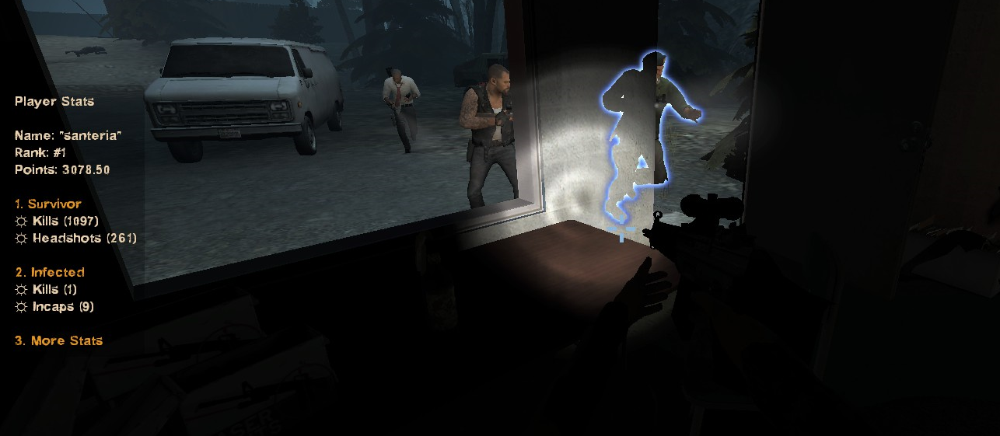
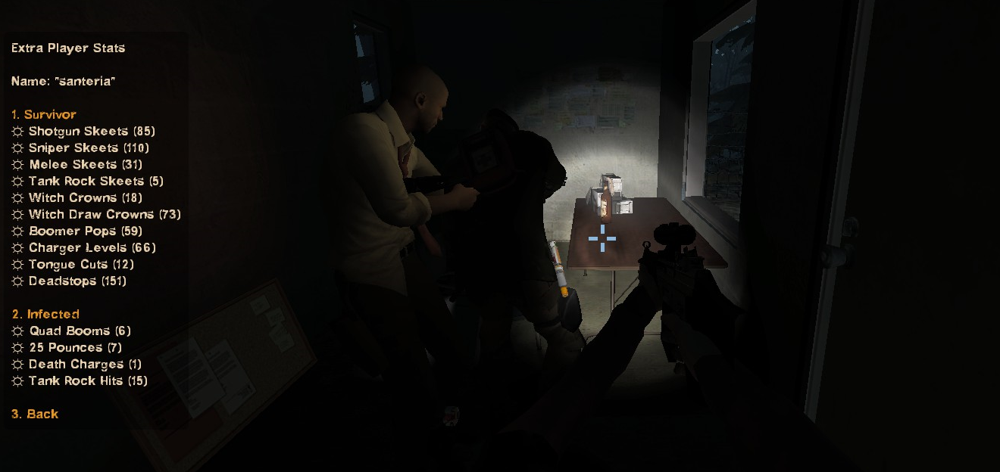
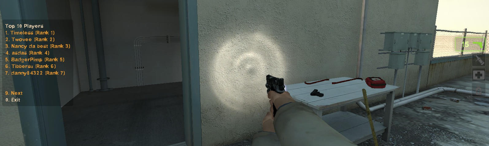
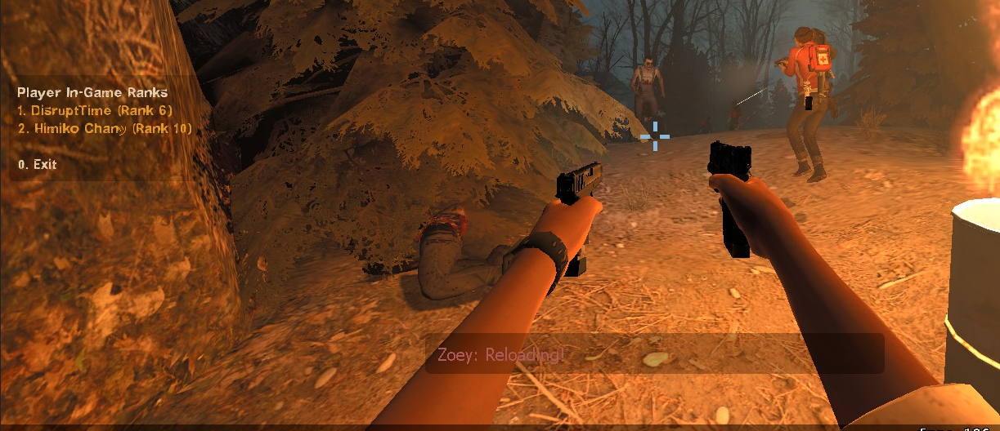

### **Simple Player Statistics Plugin for Left 4 Dead 2**

### Features

- This plugin tracks and records player statistics from human players. The following statistics are currently being recorded:

  Basic Statistics (Default)

  | Name               | Team     | Description                                                  |
  | ------------------ | -------- | ------------------------------------------------------------ |
  | Survivors Kils     | Infected | Number of times an infected has killed a survivor            |
  | Survivors Incapped | Infected | Number of times an infected player has incapped a survivor   |
  | Infected Kills     | Survivor | Number of times a survivor player has killed a Special Infected (Commons not counted) |
  | Infected Headshots | Survivor | Number of times a survivor killed a Special Infected by Headshot |

  Extra Statistics for the more skilled (Disabled by default)

  | Name                   | Team     | Description                                                  |
  | ---------------------- | -------- | ------------------------------------------------------------ |
  | Hunter Skeet (Sniper)  | Survivor | Number of hunters skeeted with sniper by a survivor          |
  | Hunter Skeet (SG)      | Survivor | Number of hunters skeeted with shotgun by a survivor         |
  | Hunter Skeet (Melee)   | Survivor | Number of hunters skeeted with melee by a survivor           |
  | Tank Rock Skeets       | Survivor | Number rocks skeeted by a survivor                           |
  | Witch Crown (Standard) | Survivor | Number of standard witch crowns by a survivor (up close)     |
  | Witch Crown (Draw)     | Survivor | Number of witch draw crowns by a survivor (chip from a distance and kill up-close) |
  | Boomer Pops            | Survivor | Number of boomer pops by a survivor (Boomer spawning and getting killed without having the chance to hurt/boom a survivor) |
  | Charger Levels         | Survivor | Number of chargers leveled by a survivor                     |
  | Smoker Tongue Cuts     | Survivor | Number of smoker tongues cut by a survivor                   |
  | Hunter Deadstops       | Survivor | Number of hunter deadstops by a survivor                     |
  | Quad Booms             | Infected | Number of times survivors have been quad boomed (all 4 boomed) |
  | 25 Hunter Pounces      | Infected | Number of 25 point hunter pounces                            |
  | Death Charges          | Infected | Number of times a charger has death charged a survivor       |
  | Tank Rock Hits         | Infected | Number of times a tank rocked a survivor                     |

  

- A customizable connect announce when a player joins displaying the current ranking/steam id/total points of the user. This feature also supports colour coded messages. 

  

- A display panel showing the player statistics of a user. This can be triggered by issuing `sm_rank` on the console or by typing `!rank`in chat.

  

- A display panel showing additional stats (disabled by default)

  

- A display panel showing the top N players sorted by their ranking. This feature also allows the the requesting player to be able to view other player's statistics/ranking on the server.

  

- A display panel showing the ranks of the players currently present in the server

  

- A point system is also implemented and can be further customized by modifying the point multipliers from the plugin configuration file (`playerstats.cfg`)

### Installation

Download the [latest](https://github.com/sourcemod-plugins/l4d2-player-stats/releases) version from the repository and extract the contents to the root of the left 4 dead 2 server installation directory. 

### Configuration

#### Database Configuration

1. Create and setup the appropriate users/credentials/privileges on your MySQL/MariaDB database system.

2. Import the [provided SQL script](https://github.com/sourcemod-plugins/l4d2-player-stats/blob/master/configs/sql-init-scripts/mysql/playerstats.sql) (under `/configs/sql-init-scripts/mysql/playerstats.sql`\) into your MySQL/MariaDB system.

3. Open `databases.cfg` file from `addons/sourcemod/configs` and add a new section named `playerstats`.

   Example:

   ```
   "playerstats"
   {
   	"host"	    "<ip address>"
   	"driver"    "mysql"
   	"database"  "<db name>"
   	"user"		"<username>"
   	"pass"		"<password>"
   	//"timeout"			"0"
   	//"port"			"0"
   }
   ```

#### Plugin Configuration

The plugin can be further customized through the `playerstats.cfg` file located under `addons/sourcemod/configs/`. The default entries will look like this:

```
"PlayerStats" {
	"StatModifiers" 
	{
		"survivor_killed" 	"1.0"
		"survivor_incapped" "1.0"
		"infected_killed" 	"1.0"
		"infected_headshot" "1.0"
		"skeet_hunter_sniper" "1.0"
        "skeet_hunter_shotgun" "1.0"
        "skeet_hunter_melee" "1.0"
        "skeet_tank_rock" "1.0"
        "witch_crown_standard" "1.0"
        "witch_crown_draw" "1.0"
        "boomer_pop" "1.0"
        "charger_level" "1.0"
        "smoker_tongue_cut" "1.0"
        "hunter_dead_stop" "1.0"
        "boomer_quad" "1.0"
        "hunter_twenty_five" "1.0"
        "death_charge" "1.0"
        "tank_rock_hits" "1.0"
	}
	"StatPanels" 
	{
		"title_rank_player"		"Player Stats"
		"title_rank_topn"		"Top {top_player_count} Players"
		"title_rank_ingame"		"Player In-Game Ranks"
		"title_rank_extras"		"Extra Player Stats"
	}
	"ConnectAnnounce" 
	{
	    "format"	"{N}Player '{G}{last_known_alias}{N}' ({B}{steam_id}{N}) has joined the game ({G}Rank:{N} {i:rank_num}, {G}Points:{N} {f:total_points})"
	}
}
```

Connect Announce Output: 


> Note: You can reload the configuration with the `sm_pstats_reload` command. Issuing this command will also synchronize the point modifiers on the STATS_MODIFIERS table.


##### Configuration Sections</u>

| Section Name    | Description                                                  |
| --------------- | ------------------------------------------------------------ |
| StatModifiers   | This section contains the modifiers for the point system. These values affects the total points of the user. For example, if a player killed 10 special infected by headshot (infected_headshot) and the point modifier is 2.5 the total points for the number of infected headshots would be 25 (10 * 2.5). |
| StatPanels      | This section allows you to customize/add title headers to each of the available display panels. |
| ConnectAnnounce | This section allows you to customize the the format of the player connect announce feature. Formatting rules are explained below. |

#### Connect Announce Formatting Rules

**<u>Colour Tags</u>** 

> Note: Some colour tags might work for Left 4 Dead 2

| Tag   | Color                                  |
| ----- | -------------------------------------- |
| {N}   | Default/normal                         |
| {O}   | Orange                                 |
| {R}   | Red                                    |
| {RB}  | Red/Blue                               |
| {B}   | Blue (green if no player on blue team) |
| {BR}  | Blue/Red                               |
| {T}   | Teamcolor                              |
| {L}   | Lightgreen                             |
| {GRA} | Grey (green if no spectator)           |
| {G}   | Green                                  |
| {OG}  | Olive                                  |
| {BLA} | Black                                  |

**<u>Special Tags</u>**

Some tags are prefixed with "d", "i" or "f". These prefixes are necessary to identify the type of the data so the plugin will be able to interpret it correctly when read from the database. 

Tag Prefix

| Prefix | Type                                 |
| ------ | ------------------------------------ |
| i      | Integer Number                       |
| d      | Date/Time (Not yet working properly) |
| f      | Decimal/Floating Point Number        |

| Tag                   | Description                                         |
| --------------------- | --------------------------------------------------- |
| {steam_id}            | Steam ID                                            |
| {last_known_alias}    | Last known alias or name of the player              |
| {d:last_join_date}    | Last join date on the server                        |
| {i:survivor_killed}   | Number of Survivors Killed (As Infected)            |
| {i:survivor_incapped} | Number of Survivors Incapped (As Infected)          |
| {i:infected_killed}   | Number of Infected Killed (As Survivor)             |
| {i:infected_headshot} | Number of Infected Killed by Headshot (As Survivor) |
| {f:total_points}      | Total Points (Sum of everything)                    |
| {i:rank_num}          | Current Ranking                                     |

Extra Tags

| Name                     | Description                                                  |
| ------------------------ | ------------------------------------------------------------ |
| {i:skeet_hunter_sniper}  | Number of hunters skeeted with sniper by a survivor          |
| {i:skeet_hunter_shotgun} | Number of hunters skeeted with shotgun by a survivor         |
| {i:skeet_hunter_melee}   | Number of hunters skeeted with melee by a survivor           |
| {i:skeet_tank_rock}      | Number rocks skeeted by a survivor                           |
| {i:witch_crown_standard} | Number of standard witch crowns by a survivor                |
| {i:witch_crown_draw}     | Number of draw crowns by a survivor                          |
| {i:boomer_pop}           | Number of boomer pops by a survivor                          |
| {i:charger_level}        | Number of charger levels by a survivor                       |
| {i:smoker_tongue_cut}    | Number of smoker tongue cuts by a survivor                   |
| {i:hunter_dead_stop}     | Number of hunter deadstops by a survivor                     |
| {i:boomer_quad}          | Number of times survivors have been quad boomed (all 4 boomed) |
| {i:hunter_twenty_five}   | Number of 25 point hunter pounces                            |
| {i:death_charge}         | Number of times a charger has death charged a survivor       |
| {i:tank_rock_hits}       | Number of times a tank rocked a survivor                     |


------

### ConVars

| Name                     | Description                                                  | Default value | Min Value | Max Value |
| ------------------------ | ------------------------------------------------------------ | :------------ | --------- | --------- |
| pstats_enabled           | Enable/Disable this plugin                                   | 1             | 0         | 1         |
| pstats_debug_enabled     | Enable debug messages (for debugging purposes only)          | 0             | 0         | 1         |
| pstats_versus_exclusive  | If set, the plugin will only work for versus gamemodes       | 1             | 0         | 1         |
| pstats_record_bots       | Sets whether we should record bots. By default only human players are recorded. | 0             | 0         | 1         |
| pstats_menu_timeout      | The timeout value for the player stats panel                 | 30 (seconds)  | 3         | 9999      |
| pstats_max_top_players   | The max top N players to display                             | 10            | 10        | 50        |
| pstats_extras_enabled    | Include extra stats to be recorded                           | 0             | 0         | 1         |
| pstats_display_type      | 1 = Display points, 2 = Display the count, 3 = Both points and count | 2             | 1         | 3         |
| pstats_show_rank_onjoin  | If set, player rank will be displayed to the user on the start of each map | 1             | 0         | 1         |
| pstats_cannounce_enabled | If set, connect announce will be displayed to chat when a player joins | 1             | 0         | 1         |

### Commands

>  **Note**: These commands can also be invoked from chat (e.g. `!rank`, `!top 10`, `!ranks`, `!pstats_reload`)

| Name             | Description                                                  | Parameters | Permission   | Parameter Description                  |
| ---------------- | ------------------------------------------------------------ | ---------- | ------------ | -------------------------------------- |
| sm_rank          | Display the current stats & ranking of the requesting player. A panel will be displayed to the player. | None       | Anyone       | None                                   |
| sm_top           | Display the top N players. A menu panel will be displayed to the requesting player | Number     | Anyone       | The number of players to be displayed. |
| sm_ranks         | Display the ranks of the players currently playing in the server. A menu panel will be displayed to the requesting player. | Number     | Anyone       | The number of players to be displayed. |
| sm_pstats_reload | Reloads plugin configuration. This is useful if you have modified the `playerstats.cfg` file. 'This command also synchronizes the modifier values set from the configuration file to the database. This is quite an expensive operation, so please only use this command when necessary. | None       | Admin (Root) | None                                   |
| sm_hidestats     | Allows a player to prevent other players from viewing his extra statistics. | None       | Anyone       | None                                   |

